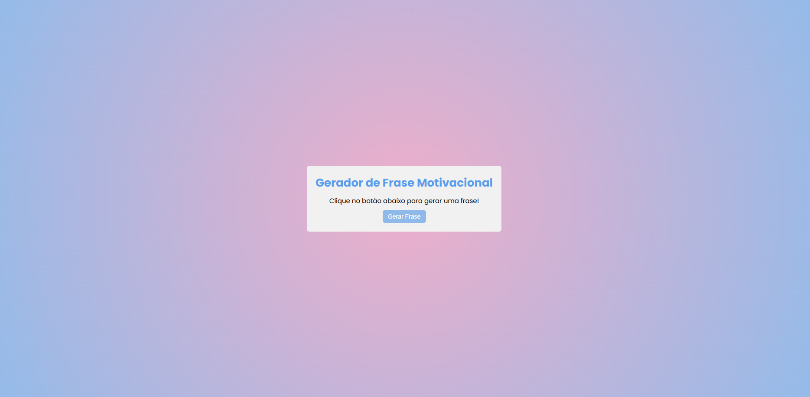

# Gerador de Frases Motivacionais

## 📌 Descrição

Este projeto é um gerador de frases motivacionais desenvolvido com React e Vite. Ao clicar no botão, o usuário recebe uma frase inspiradora aleatória, com animação suave de transição.

## 🚀 Funcionalidades

- Gerar frase aleatória: Ao clicar no botão, uma nova frase motivacional é exibida.
- Animação de transição: A frase desaparece e reaparece suavemente, proporcionando uma experiência agradável ao usuário.

## 🛠 Tecnologias Utilizadas

- React: Biblioteca JavaScript para construção da interface.
- Vite: Ferramenta de build rápida e moderna.
- CSS: Estilização da aplicação e animações.

## 📦 Como Rodar o Projeto

1. Clone o repositório:

```bash
git clone https://github.com/endriusssantos/gerador-de-frases-motivacionais.git
```

2. Navegue até o diretório do projeto:

```bash
cd gerador-de-frases-motivacionais
```

3. Instale as dependências:

```bash
npm install
```

4. Inicie o servidor de desenvolvimento:

```bash
npm run dev
```

5. Abra o navegador e acesse:

```bash
http://localhost:5173
```

## 📸 Preview



## 🌐 Acesse Online

Você pode testar a aplicação diretamente no seguinte link:

👉 [Link para a aplicação](https://gerador-de-frases-motivacionais.vercel.app)

## 👨‍💻 Contribuições

Sinta-se à vontade para contribuir com melhorias ou correções. Para isso:

- Faça um fork deste repositório.
- Crie uma branch para sua feature (git checkout -b feature/MinhaFeature).
- Faça o commit das suas alterações (git commit -am 'Adiciona nova feature').
- Envie para o repositório remoto (git push origin feature/MinhaFeature).
- Abra um Pull Request.

## 📄 Licença

Este projeto está licenciado sob a Licença MIT - veja o arquivo LICENSE
para mais detalhes.
